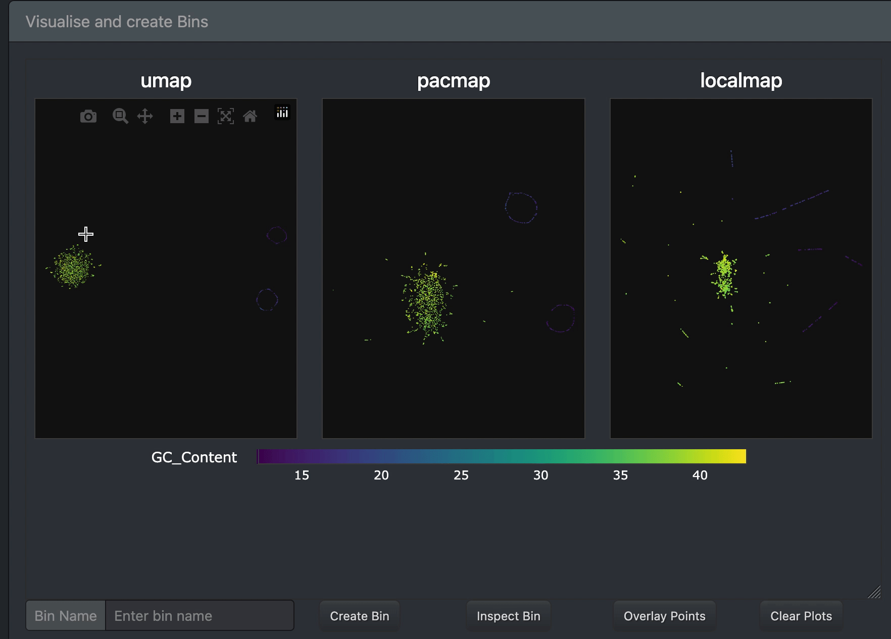

# Interactive binning

## Overview

`b2w` is an interactive Dash application for exploring read embeddings and creating bins using lasso-based selection.

## Launching the app

Run from command line:

```bash
kmer-ord bin -d <database.sqlite> -o <output_dir>
```

Example

```bash
kmer-ord bin -d results/kmerord.sqlite -o results/bins
```

Once started, open your browser at:

```bash
http://localhost:8050
```

or 

```bash
http://127.0.0.1:8050
```

## Inferface overview

### concepts

Understanding the interface is easiest if you think in terms of:

- each point is a read
- coordinates are embeddings (e.g UMAP, PCA)
- color reflect features (numeric or categorical)
- lasso selection defines a subset of reads
- bins are a saved selection of reads (with filters and polygon)

### Layout

#### Sidebar

The sidebar contains feature selection and filtering options

#### Main panel

The main panel contains scatter plots of the embeddings, controls for binning and bin instpection, and shows the bins as they are created

### Exploring embeddings

1. Select one or more coordinate systems (DR methods)
2. Choose a feature to color the points by
3. Click `Update plots`

### Comparing features

Switch to feature comparison mode

1. Select a single coordinate system (DR method)
2. Select muliple features to color point with
3. Click `Update plots`

Each panel will show the same embedding coloured by a different feature

### Filtering the data

Use filters to restrict which reads are shown:
- Set the min/max range for numerical features 
- Select using a checklist for categorical features

This filter selects:
- which points (reads) are visualised
- which points are passed to bin selection

So the filters will affect both the visualisations as well as the bins. Hence, filter with caution, and do not filter if all the reads of a specific bin are of interest.

Filtering can be useful for high-coverage and relativly simple datasets. For example, one can bin only reads > 10kb.

### Creating a bin

1. Use the lasso tool (top-right of a plot) to select a group of points
2. Enter a sensible bin name
3. Click `Create Bin`

If successful, the bin name and some properties therof will appear in the `Bin List`

Each bin stores
- the coordinate system (embedding) that was used to lasso points in.
- the selected lasso coordinates (polygon)
- active filters

Lasso a cluster, name it, and click `Create Bin`.



### Inspect a selection

Before creating a bin, it can be useful to inspect properties of selected points/reads. We provide functionality to inspect the selected points by showing a table with associated features.

1. Use the lasso tool (top-right of a plot) to select a group of points
2. Click `Inspect Bin`

### Overlay selected points

In case you want to inspect where the selected points are positioned in other coordinate systems (embeddings), use `Overlay points`. This will highlight the selected points from a given embedding across all plots. 

1. Use the lasso tool (top-right of a plot) to select a group of points
2. Click `Overlay points`

This is a powerful way to inspect cluster consistency across embeddings, detect contamination, and helps to build confidence in binning decisions.


### Clear plots

The button `Clear plots` is useful to

1. remove overlays
2. reset plots to the last updated plot state


### Export bins

Once one or more bins are created, the bins can be exported by clicking the `Export bins` button.

For each bin, the following files are written in the specified output directory

1. `<bin_name>.csv`, a data table containing the selected reads and associated features
2.  `<bin_name>.fasta` or `<bin_name>.fastq` containing the filtered sequences.


### Notes

- Only one lasso selection can be active at a time
- You must click `Update plots` when changing the inputs
- Filters apply to everything (plots, bins, exports)
- Clearing plots does not delete bins

### Tips

- Use feature comparison mode to identify meaningful splits
- apply filters before binning with caution
- Use overlay to verify consistency across embeddings
